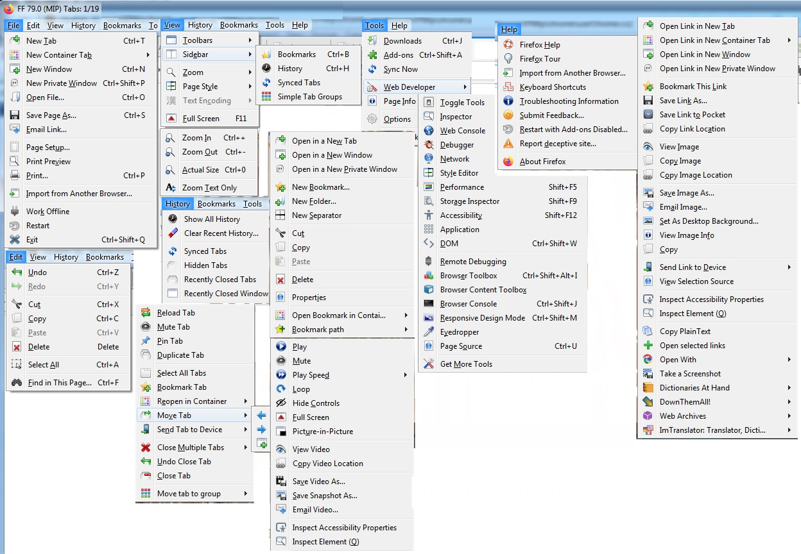
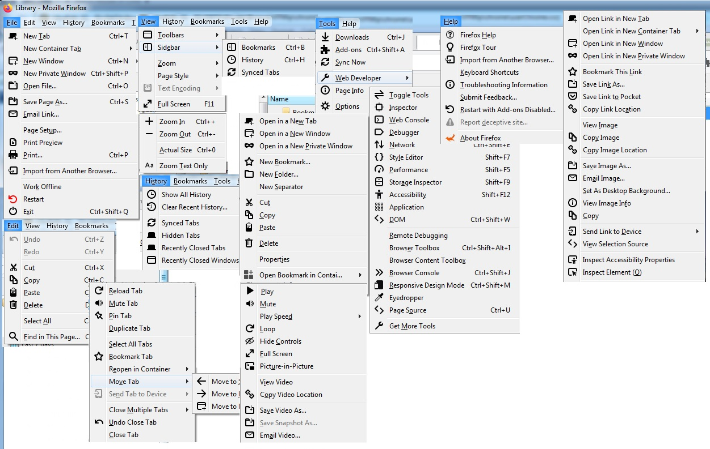
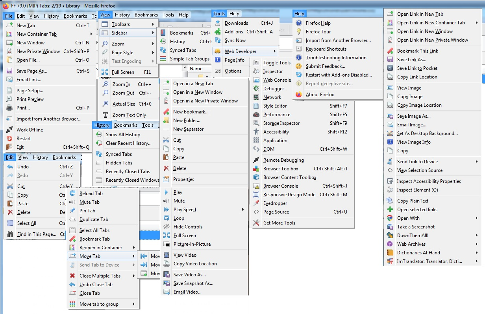
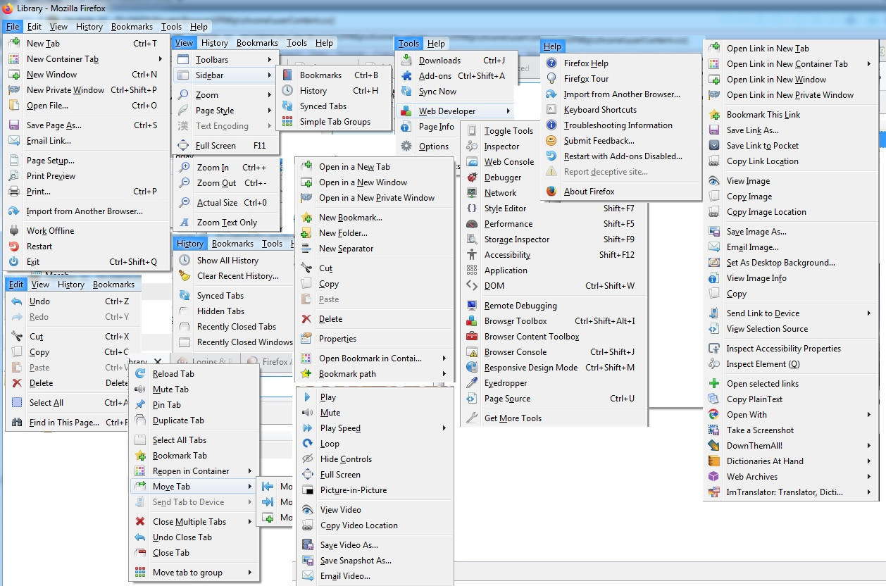
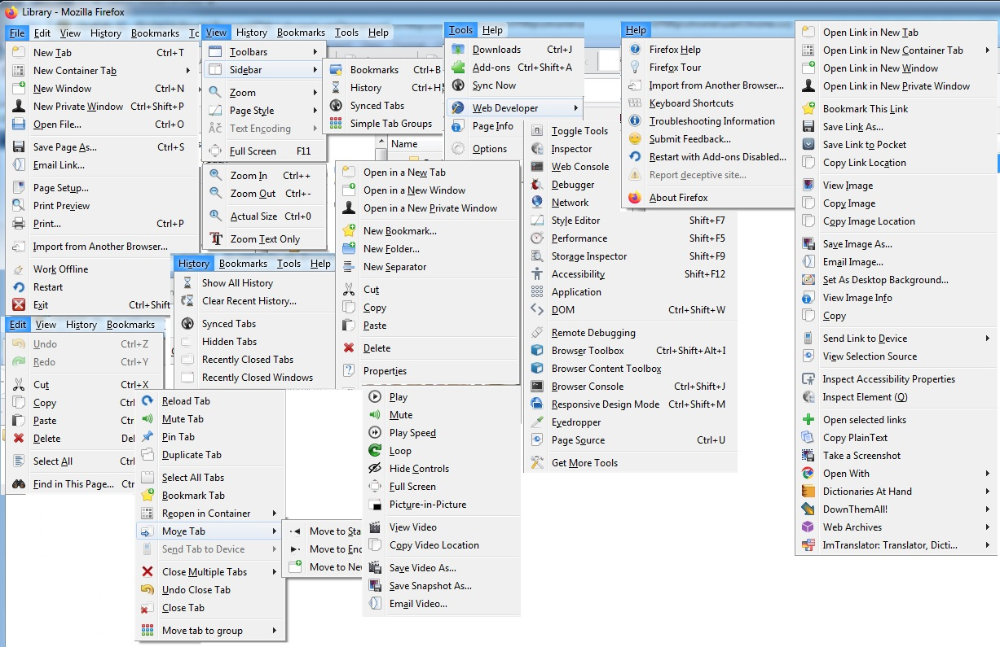
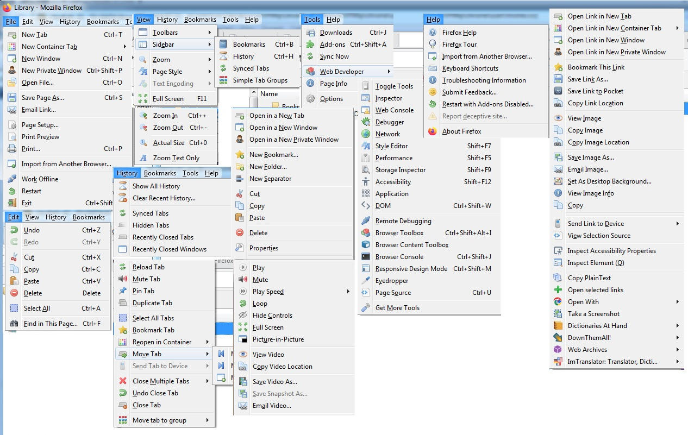
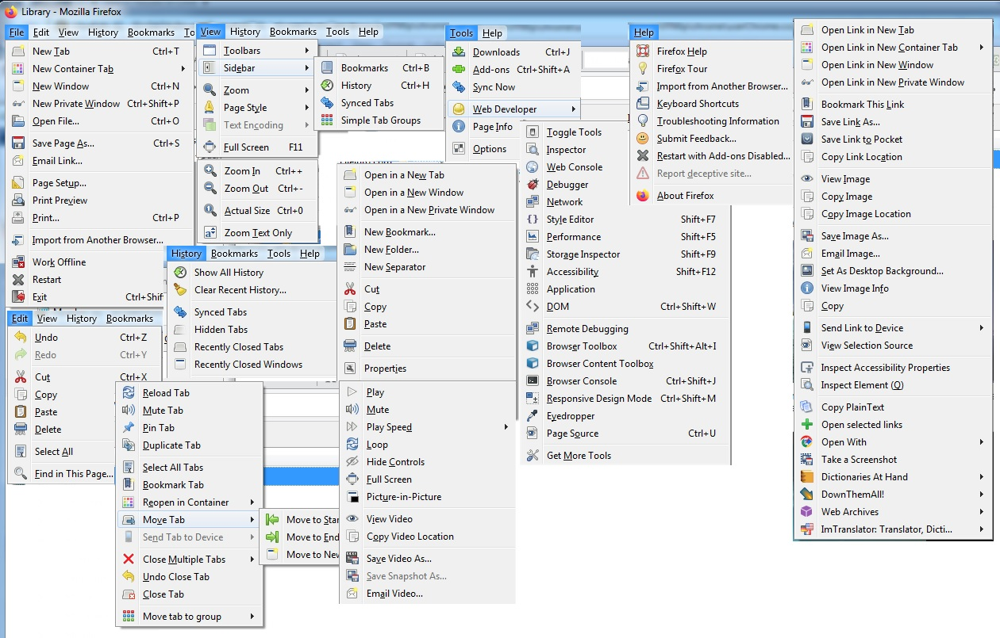

# Menu Icon Plus CSS (MIP/CSS) v1.0
## Add Icons To Firefox Menus/Context-Menus

This project is a bunch of CSS files (and images) that you *@import* in your *userChrome.css* and *userContent.css* in Firefox to add icons to the Firefox toolbar menus and to various context menus. It currently styles every menuitem that exists in XUL, but the **panels** (those new white pop-up menus, which are grey in Darkmode) are not yet styled, that will come later.

The project is a *remake* of the classic [Menu Icon Plus XUL extension](http://www.codedawn.com/menu-icons-plus.php) for Firefox by **Justin Rodes**. The extension of course no longer works, but as I worked with its files, I discovered it wasn't working well in my FF52: It had a lot more icons than were applied in later Firefox versions, so you may discover many icons in **MIP/CSS** that you were not seeing before. Also, the Menu Icon Plus XUL extension styled all the Firefox Menus *and several other extensions on top of that* - **MIP/CSS** does not pretend to style extensions, except the built-in ones. There *is* a file included (mip_worksheet-AddIconsToExtensions.css) which does add icons to some extensions, but this is for my own use and not itended to be grown to support every extension out there.

AFAIK, I've styled every XUL menu/menuitem in Firefox; I've styled stuff I cannot even see, but if you find something I've forgotten, open an issue. The method used to add the icons was suggested by Aris-t2 (thanks!), and it inserts a CSS element before the menuitems. Because of this, it is not possible to globally make every disabled menuitem greyed-out in a single CSS statement. I think I have covered all the meuitems that *can* be disabled, but you may find some I've forgotten (open an issue to let me know).

You might not agree with some icons choices, or choice of selectors, feel free to open an issue. Note that some menuitems can only be selected by their labels, and labels change with the language used in Firefox, so some things, very few, will not style correctly if your Firefox is not in English; feel free to open an issue and we can add your own language's labels to the CSS files, or suggest a different selector.

This project is (c) Sylvain "B00ze64" B. and released under the Creative Commons Attribution License v4.0.

# Pre-Requisites

Besides copying all the projet's files correctly in your profile/chrome folder and modifying your *userChrome.css* and *userContent.css*, there is only one pre-requisite. Basically, if you want to style the bookmarks folders correctly, you need **Aris-t2's css/generalui/bookmark_icons_colorized.css** and the images it references. That file needs to be *@import'ed* in your userChrome/userContent **BEFORE** the MIP/CSS files, which override the images used by the former. The **bookmark_icons_colorized.css** and related files can be found at Aris-t2's [CustomCSSforFx](https://github.com/Aris-t2/CustomCSSforFx).

# The Icon Themes

The original Menu Icon Plus XUL extension included 5 themes, and **FF-Menu-Icon-Plus-CSS (MIP/CSS)** includes all 5, plus 3 more: There is a **Firefox SVG** theme which uses exclusively built-in Firefox SVG icons, a Firefox "Theme" which you can use to override icons from other themes with the old PNG icons from Firefox 24 and 52, and **Fugue Plus** which is a mix of Fugue and whatever icon I find better looking from the other themes. I have tested all of them, but the only theme I've really spent a lot of time on is **Fugue Plus**. You are encouraged to open issues and make corrections or suggestions, especially for **Firefox SVG**.

All the Major themes include the icons from all the other themes commented out. This makes it easy for you to pick the theme you like most, and exchange the icons you don't with ones you do. You are encouraged to do this.

All the Themes in Alphabetical order: 

1. **The Crystal Project**

    1. http://www.everaldo.com/
    2. https://commons.wikimedia.org/wiki/Category:Crystal_Project

2. The **Firefox** Theme (overrides some icons with old FF24/52 ones; can be used alone)

3. The **Firefox SVG** Theme (uses built-in Firefox SVG icons)

4. **Fugue** icons by Yusuke Kamiyamane (http://p.yusukekamiyamane.com/)

5. **Fugue Plus** (uses Fugue and Crystal and some other icons)

6. **Oxygen**

    1. https://web.archive.org/web/20100301151643/https://www.oxygen-icons.org/
    2. https://github.com/pasnox/oxygen-icons-png

7. **Silk** icons by Mark James, Birmingham (UK) (http://www.famfamfam.com/)

8. **Tango** (http://tango-project.org/)

# File Structure

Every theme has up to 3 files, and some override files which only change the picture used but do not themselves insert the icon element (you use them AFTER a complete theme file). Let's take the Crystal theme for example, you will find:

* mip_Crystal-Config.css:
    * This is used in *userContent.css* and adds icons to the old about:config, which you can still get to as of now.
* mip_Crystal-Library.css:
    * This is also used in *userContent.css* and adds icons to the Library when you are opening it inside a TAB.
* mip_Crystal-Menus.css:
    * This is used in *userChrome.css* and adds icons to the Firefox menus and to the Library window.
* mip_override_CutCopyPaste-Crystal.css:
    * This gives whatever theme is used before it the Cut/Copy/Paste icons from Crystal.

# Installation

Just extract the project into your *Profile/chrome* folder, so that you have *MipCss* and *MipImages* folders **inside** the *chrome* folder. Use the included *userChrome.css* and *userContent.css* as templates to modify your own. You are EXPECTED to edit the userChrome and userContent files to select WHICH theme you want to use. And as mentionned earlier, you are **strongly encouraged** to install the *bookmark_icons_colorized.css* file from Aris-t2's [CustomCSSforFx](https://github.com/Aris-t2/CustomCSSforFx).

# Public Domain Images

There are a FEW images in the PublicDomain folder that I downloaded off from generic icon sites which have no attribution. If you recognize your work, please open an issue so that proper credits can be given.

# Themes Previews

### The Crystal Project

### Firefox SVG

### Fugue

### Fugue Plus

### Oxygen

### Silk

### Tango

